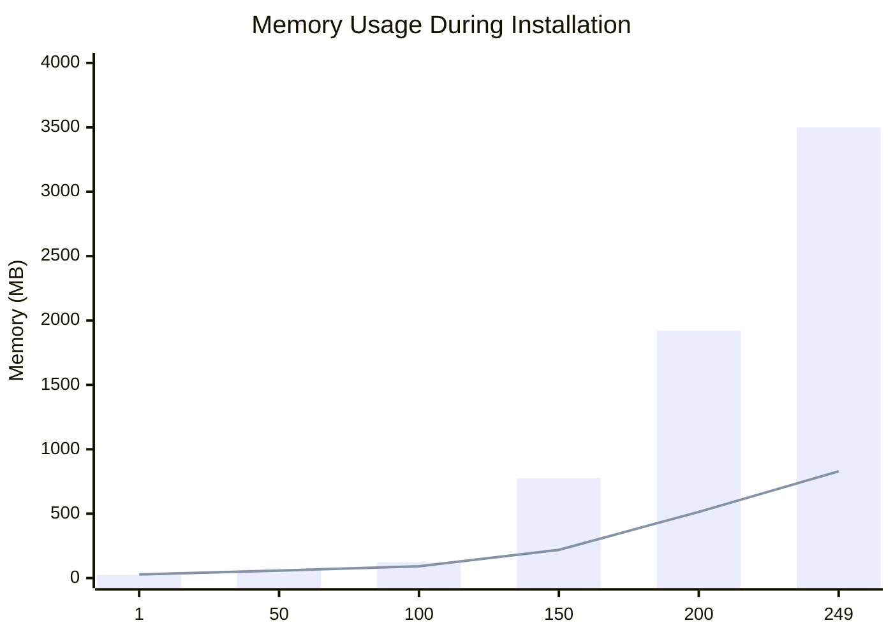

# Drush Site Install Profiling Research

> [!NOTE]
> This research compares `drush site:install` performance between Drupal 11.1.9 and Drupal 11.3.1 on YMCA Website Services.

## Executive Summary

| Metric | Drupal 11.1 | Drupal 11.3 | Improvement |
|--------|-------------|-------------|-------------|
| **Total Time** | 537 sec (9 min) | 339 sec (5.6 min) | **37% faster** |
| **Peak Memory** | 4.38 GB | 955 MB | **78% less** |
| Container Rebuilds | 282 | 147 | **48% fewer** |
| Kernel Updates | 279 | 153 | **45% fewer** |

> [!IMPORTANT]
> **Drupal 11.3's batched module installation delivers massive performance gains with zero code changes required.**

---

## Key Metrics Comparison (XHProf Data)

| Metric | Drupal 11.1 | Drupal 11.3 | Improvement |
|--------|-------------|-------------|-------------|
| ModuleInstaller::install calls | 265 | 258 | 3% fewer |
| Kernel updates | 279 | 153 | **45% fewer** |
| Container rebuilds | 282 | 147 | **48% fewer** |
| StaticReflectionParser::parse | 69,093 | 36,853 | **47% fewer** |
| Reflection memory | 13,038 MB | 6,252 MB | **52% less** |

---

## Memory Growth Comparison



### Drupal 11.1 Memory Growth

| Module # | Time | Memory | Growth Rate |
|----------|------|--------|-------------|
| 1 | 2.6s | 25 MB | baseline |
| 50 | 29s | 65 MB | +0.8 MB/module |
| 100 | 77s | 123 MB | +1.2 MB/module |
| 150 | 148s | 776 MB | **+13 MB/module** |
| 200 | 261s | 1.92 GB | **+23 MB/module** |
| 249 | 426s | 3.5 GB | **+32 MB/module** |
| **Final** | **537s** | **4.38 GB** | - |

### Drupal 11.3 Memory Growth

| Module # | Time | Memory | Growth Rate |
|----------|------|--------|-------------|
| 1 | 3.7s | 28 MB | baseline |
| 50 | 8.4s | 58 MB | +0.6 MB/module |
| 100 | 15s | 92 MB | +0.7 MB/module |
| 150 | 49s | 219 MB | +2.5 MB/module |
| 200 | 144s | 514 MB | +5.9 MB/module |
| 249 | 280s | 829 MB | +6.4 MB/module |
| **Final** | **339s** | **955 MB** | - |

> [!TIP]
> Memory growth in 11.3 stays **linear** vs **exponential** in 11.1!

---

## Why 11.3 Is Faster

<details>
<summary><strong>Technical explanation</strong></summary>

### The Problem in Drupal 11.1

In Drupal 11.1, `ModuleInstaller::install()` processes modules **one at a time**:

```php
// Drupal 11.1 - core/lib/Drupal/Core/Extension/ModuleInstaller.php
foreach ($module_list as $module) {
    // Installs ONE module
    // Rebuilds container EACH TIME
    $this->updateKernel($module_filenames);
}
```

**Result**: 265 modules → 279 container rebuilds → 69,093 reflection parser calls

### The Solution in Drupal 11.2+

Drupal 11.2 introduced batched installation via [#3416522](https://www.drupal.org/project/drupal/issues/3416522):

```php
// Drupal 11.3 - core/lib/Drupal/Core/Extension/ModuleInstaller.php
$module_groups = [];
foreach ($module_list as $module) {
    $module_groups[$index][] = $module;
    // Group up to 20 modules together
    if (count($module_groups[$index]) === Settings::get('core.multi_module_install_batch_size', 20)) {
        $index++;
    }
}

// Install each GROUP with single container rebuild
foreach ($module_groups as $modules) {
    $this->doInstall($modules, ...);
}
```

**Result**: 258 modules → 147 container rebuilds → 36,853 reflection parser calls

</details>

---

## Top Memory Consumers

### Drupal 11.1

| Function | Calls | Memory (MB) |
|----------|-------|-------------|
| `StaticReflectionParser::parse` | 69,093 | 13,038 |
| `TokenParser::__construct` | 67,807 | 12,419 |
| `Connection::query` | 331,108 | 6,864 |
| `StatementWrapperIterator::execute` | 360,648 | 6,745 |
| `MenuTreeStorage::safeExecuteSelect` | 245,444 | 4,616 |

### Drupal 11.3

| Function | Calls | Memory (MB) |
|----------|-------|-------------|
| `TokenParser::__construct` | 36,853 | 6,641 |
| `Connection::query` | 303,698 | 6,361 |
| `StaticReflectionParser::parse` | 36,853 | 6,252 |
| `StatementWrapperIterator::execute` | 331,987 | 6,234 |
| `MenuTreeStorage::safeExecuteSelect` | 230,127 | 4,384 |

> [!NOTE]
> Reflection parser calls dropped by **47%** (69,093 → 36,853)

---

## Recommendations

### 1. Upgrade to Drupal 11.2+ (Completed in drupal113 branch)

- Batched module installation works automatically
- No code changes required
- **37% faster install, 78% less memory**

### 2. Consider Tuning Batch Size

Add to `settings.php` for different batch sizes:

```php
// Default is 20, increase for faster systems with more RAM
$settings['core.multi_module_install_batch_size'] = 30;
```

### 3. Future Investigation

- `MenuTreeStorage` still generates 230K+ queries
- `ModuleHandler::invokeAllWith` time increased in 11.3 (investigate hooks)

---

## Profiling Data

Raw logs available in [`docs/profiling-logs/`](profiling-logs/):

| File | Description |
|------|-------------|
| [`drush_si_profiling_standard_11.1.log`](profiling-logs/drush_si_profiling_standard_11.1.log) | Drupal 11.1.9 install log |
| [`drush_si_profiling_standard_11_3.log`](profiling-logs/drush_si_profiling_standard_11_3.log) | Drupal 11.3.1 install log |

---

## Related Issues

- [Drupal #3416522: Add ability to install multiple modules with single container rebuild](https://www.drupal.org/project/drupal/issues/3416522)
- [Drupal #3395260: Performance improvements for AttributeClassDiscovery](https://www.drupal.org/project/drupal/issues/3395260)
- [Drupal #3473563: Change record for container_rebuild_required](https://www.drupal.org/node/3473563)

---

## Environment

| Component | Version |
|-----------|---------|
| YMCA Website Services | 4.0 |
| PHP | 8.3 |
| Profiler | XHProf + XHGui |
| Platform | DDEV on macOS (M3 Pro) |
